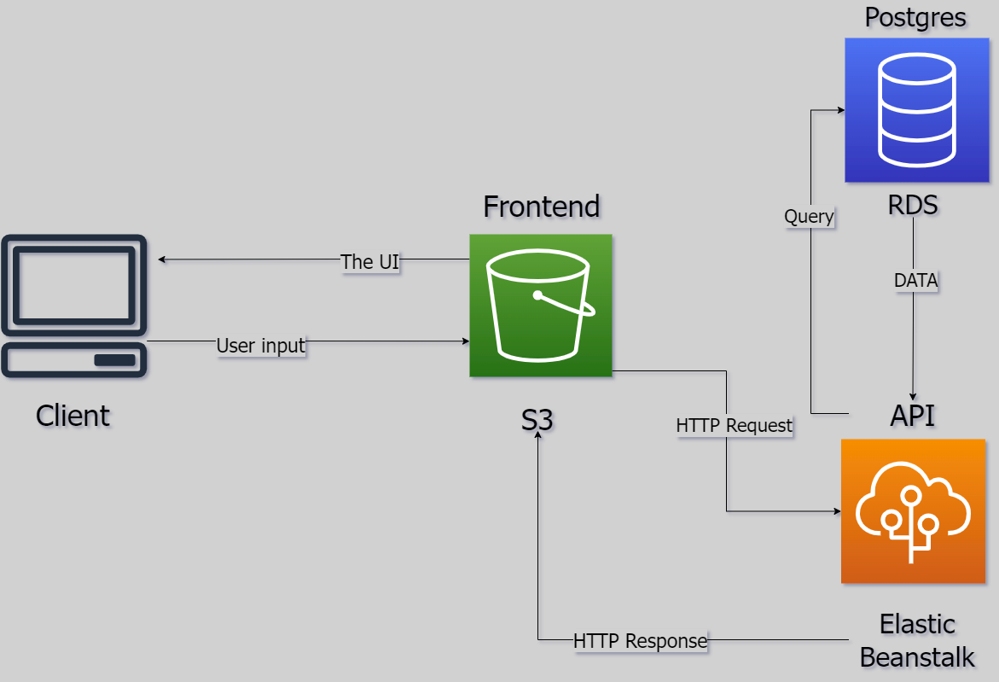

# Frontend:
- It's an angular app that communicate with an API.

# Backend:
- Expres API that is connected to RDS DB 'Postgres' from AWS.
- And it takes HTTP reqest from the angular app and send the response with the data required.

# CI/CD:
- The git repo is connected with circleci.
- And the circleci install the App dependencies and build it.
- Then it deploy the frontend to S3.
- And the backend to Elastic Beanstalk.

### Rest of pipeline logic are in the 'Pipeline process.md' file 

### Simple diagram for AWS services that i used:

