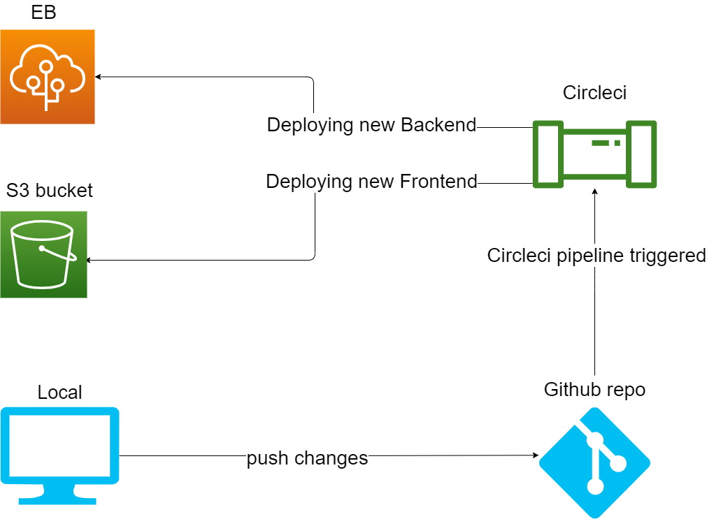

# Pipeline process :

## Using circleci :

#### First configuring environment variables.

#### Installing orbs:
- node & aws-cli & eb in order to build & deploy out APP.

#### Installing the image and configure it:
- Installing node
- Setup the Elastic Beanstalk & aws-cli

#### Building and deploying the APP:
- Installing both the back and front end dependencies.
- Build both the back and front end.
- Deploying the angular APP to S3 using aws-cli.
- Deploying the API to Elastic Beanstalk using eb.

#### Simple giagram for the process
